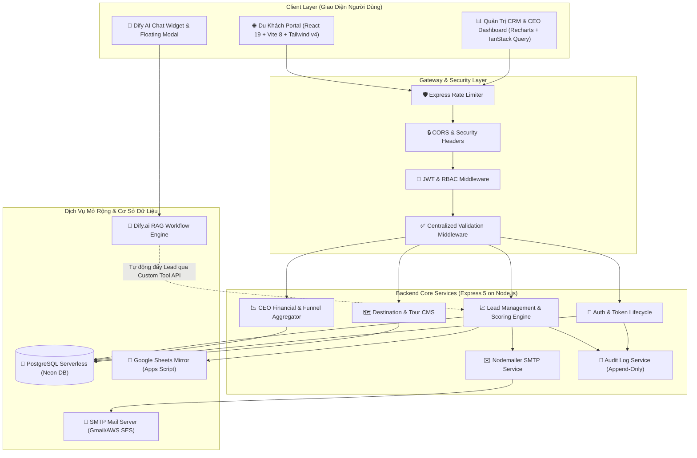

# 🇻🇳 Vietnam Journey (Touris Vietnam)
### *Nền Tảng Du Lịch 5 Sao & Hệ Thống Quản Trị Doanh Nghiệp Thông Minh (CRM & AI Assistant)*

<div align="center">

[](https://tour-vietnam.vercel.app/)
[](https://tour-vietnam.vercel.app/crm)
[](https://github.com/iNuss99/Touris_Vietnam)
[](LICENSE)

<br/>


<p align="center">
  <b>Trải nghiệm du lịch tinh hoa 5 sao kết hợp Trợ lý AI cá nhân hóa và Hệ thống CRM/CEO Analytics toàn diện.</b>
</p>

</div>

---

## 📑 Mục Lục
1. [Giới Thiệu Tổng Quan](#-1-giới-thiệu-tổng-quan)
2. [Kiến Trúc Hệ Thống & Luồng Dữ Liệu](#-2-kiến-trúc-hệ-thống--luồng-dữ-liệu)
3. [Hệ Thống Phân Hạng Dịch Vụ & 6 Điểm Đến Master](#-3-hệ-thống-phân-hạng-dịch-vụ--6-điểm-đến-master)
4. [Tính Năng Nổi Bật](#-4-tính-năng-nổi-bật)
   - [Portal Du Khách (Luxury Landing Page)](#41-portal-du-khách-luxury-landing-page)
   - [Trợ Lý Ảo AI Dify & RAG Agent](#42-trợ-lý-ảo-ai-dify--rag-agent)
   - [Hệ Thống Quản Trị CRM & CEO Analytics](#43-hệ-thống-quản-trị-crm--ceo-analytics-dashboard)
   - [Phân Quyền RBAC & Bảo Mật PII](#44-phân-quyền-rbac--bảo-mật-dữ-liệu-pii)
5. [Cấu Trúc Thư Mục Dự Án](#-5-cấu-trúc-thư-mục-dự-án)
6. [Hướng Dẫn Cài Đặt & Khởi Chạy](#-6-hướng-dẫn-cài-đặt--khởi-chạy)
7. [Danh Sách REST API Endpoints](#-7-danh-sách-rest-api-endpoints)
8. [Kiểm Thử & Đảm Bảo Chất Lượng (TDD Testing)](#-8-kiểm-thử--đảm-bảo-chất-lượng-tdd-testing)
9. [Tối Ưu Hóa Hiệu Năng & Bảo Mật](#-9-tối-ưu-hóa-hiệu-năng--bảo-mật)
10. [Hướng Dẫn Triển Khai (Deployment)](#-10-hướng-dẫn-triển-khai-deployment)
11. [Đội Ngũ Phát Triển & Bản Quyền](#-11-đội-ngũ-phát-triển--bản-quyền)

---

## 🌟 1. Giới Thiệu Tổng Quan

**Vietnam Journey (Touris Vietnam)** là nền tảng số hóa du lịch 5 sao cao cấp giải quyết bài toán kép:
1. **Nâng tầm trải nghiệm du khách (Customer Experience):** Mang đến không gian khám phá danh lam thắng cảnh, văn hóa, ẩm thực Việt Nam đậm chất thượng lưu với giao diện Champagne Gold & Dark Elegance, hiệu ứng mượt mà, hỗ trợ đa ngôn ngữ và Trợ lý ảo AI tư vấn 24/7.
2. **Tối ưu hóa năng lực quản trị (Enterprise Governance):** Cung cấp cho ban điều hành và đội ngũ kinh doanh hệ thống CRM thời gian thực, tự động chấm điểm khách hàng tiềm năng (**Lead Scoring Engine**), phân tích doanh thu (**CEO Dashboard Analytics**) và kiểm soát phân quyền đa tầng (**Role-Based Access Control**).

---

## 🏗️ 2. Kiến Trúc Hệ Thống & Luồng Dữ Liệu

### Sơ đồ phân tầng kiến trúc (Architecture Diagram)



---

## 💎 3. Hệ Thống Phân Hạng Dịch Vụ & 6 Điểm Đến Master

Hệ thống được quy chuẩn hóa thành **3 phân hạng dịch vụ cao cấp** và **6 điểm đến du lịch biểu tượng** của Việt Nam:

### 3.1. Ba Phân Hạng Dịch Vụ (Service Tiers)

| Tiêu Chí | Gói Explorer (Khám Phá) | Gói Signature (Dấu Ấn) ⭐ *Best Seller* | Gói Prestige (Thượng Lưu) 👑 *VVIP* |
| :--- | :--- | :--- | :--- |
| **Đối tượng** | Khách trẻ, nhóm bạn tự do, tối ưu chi phí | Cặp đôi, gia đình tìm kiếm sự tiện nghi trọn gói | Doanh nhân, VIPs, trăng mật nghỉ dưỡng cao cấp |
| **Tiêu chuẩn lưu trú** | Khách sạn Boutique 3-4 sao trung tâm | Resort 5 sao mặt biển / Du thuyền 5 sao | Resort 5-6 sao quốc tế (JW Marriott, InterCon, Six Senses) |
| **Phương tiện** | Xe Limousine đưa đón theo tuyến | Vé máy bay khứ hồi + Limousine VIP riêng | Vé Thương gia + Xe riêng Dcar/Alphard + Cano riêng |
| **Ẩm thực** | Buffet sáng + Đặc sản địa phương tuyển chọn | Fine-Dining hải sản, Tiệc Sunset Sundeck | Bữa ăn phục vụ bởi Chef riêng, Wine Pairing hảo hạng |
| **Đặc quyền** | Hướng dẫn viên song ngữ, vé tham quan | Spa trị liệu (1 buổi), vé VIP Fast-track | Quản gia (Butler) riêng 24/7, thiết kế menu riêng |

### 3.2. Bảng Giá 6 Điểm Đến Du Lịch Tiêu Chuẩn

| Mã | Điểm Đến | Thời Gian | Gói Explorer | Gói Signature (Best Seller) | Gói Prestige (VVIP) |
| :---: | :--- | :---: | :---: | :---: | :---: |
| `halong` | **Vịnh Hạ Long** | 2N1Đ / 3N2Đ | — | **3.850.000 VNĐ** (2N1Đ)<br>**6.900.000 VNĐ** (3N2Đ) | **12.900.000 VNĐ** *(Du thuyền 5★ Suite)* |
| `trangan` | **Tràng An Ninh Bình** | 1N / 2N1Đ / 3N2Đ | **1.850.000 VNĐ** (1N) | **5.200.000 VNĐ** (2N1Đ) | **9.800.000 VNĐ** *(Resort VIP)* |
| `sapa` | **Sa Pa Tây Bắc** | 3N2Đ | **4.500.000 VNĐ** | **7.800.000 VNĐ** | **14.200.000 VNĐ** *(Topas Ecolodge)* |
| `hoian` | **Phố Cổ Hội An** | 3N2Đ / 4N3Đ | **4.200.000 VNĐ** (3N2Đ) | **9.500.000 VNĐ** (3N2Đ) | **16.500.000 VNĐ** *(Luxury Resort)* |
| `danang` | **Đà Nẵng & Bà Nà** | 3N2Đ / 4N3Đ | **5.800.000 VNĐ** (3N2Đ) | **11.200.000 VNĐ** *(Bay khứ hồi)* | **21.900.000 VNĐ** *(InterContinental)* |
| `phuquoc` | **Đảo Ngọc Phú Quốc** | 3N2Đ / 4N3Đ / 5N4Đ | **8.900.000 VNĐ** (3N2Đ) | **15.800.000 VNĐ** *(Bay khứ hồi)* | **24.500.000 VNĐ** *(Villa hồ bơi riêng)* |

---

## ✨ 4. Tính Năng Nổi Bật

### 4.1. Portal Du Khách (Luxury Landing Page)
- **Giao Diện Champagne Gold & Dark Mode:** Bảng màu chuẩn Luxury Travel, phông chữ serif sang trọng kết hợp hiệu ứng kính mờ (Glassmorphism).
- **Chuyển Động Điện Ảnh (Cinematic Experience):** Tích hợp **Lenis Smooth Scroll** và **GSAP** tạo chuyển động cuộn êm ái, parallax mượt mà không giật khung hình.
- **Thời Tiết Thực Tế (Weather Widget):** Hiển thị nhiệt độ, độ ẩm và tình trạng thời tiết cập nhật theo thời gian thực tại các điểm đến.
- **Hỗ Trợ Đa Ngôn Ngữ (i18n):** Chuyển đổi tức thời giữa **Tiếng Việt** và **English**.
- **Âm Thanh Không Gian (Sound Ambience):** Trải nghiệm âm thanh thiên nhiên/nhạc nền thư giãn có thể bật/tắt linh hoạt.
- **Sticky Contact Bar Tỏa Sáng:** Thanh liên hệ nổi bật cố định gồm Hotline, Zalo Chat và Chatbot AI với hiệu ứng vòng tròn sóng xung kích (Pulse Ring).
- **Form Đặt Tour Thông Minh:** Xác thực dữ liệu tức thì (Realtime Validation), hỗ trợ chọn ngày, số lượng khách, phân hạng dịch vụ và tự động gửi email xác nhận đặt chỗ.

### 4.2. Trợ Lý Ảo AI Dify & RAG Agent
- **Tư Vấn Tự Động 24/7:** Phản hồi thông minh dựa trên bộ 6 tài liệu Knowledge Base chuyên sâu (lịch trình từng ngày, ẩm thực, chính sách hoàn hủy, bảng giá chuẩn).
- **Phòng Chống Ảo Giác (Anti-Hallucination Guardrails):** Tuyệt đối tuân thủ dữ liệu chuẩn, báo giá minh bạch và chuyển giao tư vấn viên con người (Human Handoff) khi có khiếu nại.
- **Tự Động Bóc Tách Lead (Lead Capture Integration):** Khi khách hàng cung cấp thông tin liên hệ trong đoạn hội thoại, Dify AI tự động gọi Custom Tool API `/api/leads/sync-dify` để đẩy trực tiếp vào hệ thống CRM.

### 4.3. Hệ Thống Quản Trị CRM & CEO Analytics Dashboard
- **Thuật Toán Chấm Điểm Khách Hàng (Lead Scoring Engine):**
  - Đánh giá điểm từ `0 - 100` dựa trên số lượng khách, phân hạng dịch vụ quan tâm (Prestige/Signature/Explorer), điểm đến và độ đầy đủ của thông tin.
  - Phân loại mức độ nóng: **HOT** (≥ 70 điểm), **WARM** (40 - 69 điểm), **COLD** (< 40 điểm).
  - Xếp hạng Grade: **A** (Khách VIP giá trị cao), **B**, **C**, **D**.
  - Tính toán tự động **Giá trị hợp đồng ước tính (Estimated Value)**.
- **CEO Dashboard Analytics (Recharts Visualization):**
  - Chỉ số tổng hợp: Tổng lead, Tỷ lệ chốt đơn (Conversion Rate), Tổng doanh thu dự kiến, Doanh thu thực tế.
  - Biểu đồ phễu chuyển đổi (Lead Funnel: New ➔ Contacted ➔ Negotiating ➔ Converted ➔ Lost).
  - Biểu đồ phân bổ nguồn khách (Website Direct, AI Chatbot, Hotline, Marketing Campaign).
  - Biểu đồ phân tích doanh số theo điểm đến du lịch.
- **Quản Trị Nội Dung (CMS):** Cập nhật hình ảnh, mô tả, mức giá tour và danh lam thắng cảnh trực quan.
- **Nhật Ký Kiểm Toán (Audit Trail - Append-Only):** Ghi vết 100% mọi hành động nhạy cảm (Đăng nhập, thay đổi trạng thái lead, phân quyền tài khoản, chỉnh sửa tour).

### 4.4. Phân Quyền RBAC & Bảo Mật Dữ Liệu PII

Hệ thống áp dụng ma trận phân quyền 4 vai trò nghiêm ngặt:

| Hành Động / Tài Nguyên | `super_admin` | `admin` | `manager` | `staff` |
| :--- | :---: | :---: | :---: | :---: |
| **Xem CEO Dashboard & Tài chính** | ✅ | ✅ | ❌ | ❌ |
| **Xem Toàn bộ Leads & Xuất dữ liệu** | ✅ | ✅ | ✅ | ❌ |
| **Xem Leads được phân công** | ✅ | ✅ | ✅ | ✅ |
| **Xem SĐT & Email Khách (Unmasked PII)** | ✅ | ✅ | ❌ *(Đã ẩn)* | ❌ *(Đã ẩn)* |
| **Cập nhật trạng thái Lead** | ✅ | ✅ | ✅ | ✅ |
| **Quản lý Tài khoản & Phân quyền** | ✅ | ❌ | ❌ | ❌ |
| **Xem Nhật ký Hệ thống (Audit Logs)** | ✅ | ✅ | ❌ | ❌ |
| **Quản trị Nội dung Tour & Điểm đến (CMS)** | ✅ | ✅ | ✅ | ❌ |

---

## 📁 5. Cấu Trúc Thư Mục Dự Án

```
Touris_Vietnam/
├── frontend/                        # Ứng dụng Giao diện Client (SPA)
│   ├── public/                      # Static assets (Favicon, OG Image, Video)
│   ├── src/
│   │   ├── assets/                  # Ảnh thắng cảnh, văn hóa, ẩm thực WebP tối ưu
│   │   ├── components/              # Giao diện thành phần Portal Khách Hàng
│   │   │   ├── AIChatModal.jsx      # Hộp thoại chat AI Consultant
│   │   │   ├── ContactForm.jsx      # Form đặt tour trực tuyến & gửi mail
│   │   │   ├── Culture.jsx          # Khám phá tinh hoa văn hóa & ẩm thực
│   │   │   ├── Destinations.jsx     # Bộ sưu tập 6 danh thắng du lịch
│   │   │   ├── Hero.jsx             # Hero banner sang trọng với hiệu ứng Parallax
│   │   │   ├── Navbar.jsx           # Thanh điều hướng Glassmorphism & i18n
│   │   │   ├── StickyContact.jsx    # 3 nút liên hệ nổi bật (Hotline/Zalo/AI)
│   │   │   ├── TourPackages.jsx     # Bảng phân hạng Explorer/Signature/Prestige
│   │   │   ├── WeatherWidget.jsx    # Widget thời tiết thời gian thực
│   │   │   └── Dashboard/           # Phân hệ Quản trị CRM & CEO Dashboard
│   │   │       ├── CeoDashboardView.jsx  # Biểu đồ phân tích tài chính & phễu CRM
│   │   │       ├── LeadsView.jsx         # Bảng dữ liệu Leads, Phân loại & Lọc
│   │   │       ├── ContentView.jsx       # CMS chỉnh sửa điểm đến & tour
│   │   │       ├── UserManagement.jsx    # Phân quyền & Quản lý tài khoản
│   │   │       ├── ReportsView.jsx       # Báo cáo thống kê & Audit logs
│   │   │       └── SettingsView.jsx      # Cài đặt hệ thống & Đổi mật khẩu
│   │   ├── context/                 # Context API quản lý Authentication
│   │   ├── i18n/                    # Dữ liệu song ngữ Tiếng Việt - Tiếng Anh
│   │   ├── styles/                  # Định nghĩa Theme Tailwind v4 & Luxury CSS
│   │   ├── App.jsx                  # Cấu hình Routing & Global Providers
│   │   └── main.jsx                 # React Entry Point
│   ├── index.html                   # Tối ưu SEO, Meta Tags & OpenGraph
│   ├── vite.config.js               # Cấu hình Build, Code Splitting & Terser
│   └── package.json
│
├── backend/                         # Máy chủ API RESTful & Dịch vụ xử lý
│   ├── api/                         # Vercel Serverless Function Handler
│   ├── src/
│   │   ├── config/                  # Cấu hình Database Pool (Neon PostgreSQL)
│   │   ├── controllers/             # Bộ điều khiển nghiệp vụ (Auth, Leads, CEO, Tours...)
│   │   ├── middlewares/             # Middleware (JWT, RBAC, Validation, Rate Limit)
│   │   ├── routes/                  # Định tuyến API
│   │   ├── services/                # Email Service (Nodemailer), Audit Trail Service
│   │   └── server.js                # Khởi tạo Server Express 5
│   ├── tests/                       # 44/44 Test Suites (Node.js Native Test Runner)
│   ├── db/                          # Database Schema, Migrations & Seed Scripts
│   ├── .env.example                 # Mẫu cấu hình môi trường Backend
│   ├── vercel.json                  # Cấu hình Serverless API Routing
│   └── package.json
│
├── kb/                              # Master Knowledge Base chuẩn hóa cho AI Dify (6 tập tin)
│   ├── 01_bot_persona_rules_pricing.md
│   ├── 02_tour_halong_trangan_sapa.md
│   ├── 03_tour_hoian_danang_phuquoc.md
│   ├── 04_culture_gastronomy.md
│   ├── 05_policies_terms_crm.md
│   └── 06_faqs_fewshot_scripts.md
│
├── scripts/                         # Script tối ưu ảnh WebP, trích xuất dữ liệu
├── .env.example                     # Mẫu biến môi trường Root
├── vercel.json                      # Cấu hình Deploy Frontend trên Vercel
├── TV_KB.md                         # Toàn bộ Knowledge Base gộp
└── package.json                     # Root Project Runner
```

---

## 🚀 6. Hướng Dẫn Cài Đặt & Khởi Chạy

### 6.1. Yêu Cầu Tiên Quyết
- **Node.js**: Phiên bản `>= 18.0.0` (Khuyến nghị Node.js LTS 20+)
- **NPM**: Phiên bản `>= 9.0.0`
- **PostgreSQL Database**: Khuyến nghị cơ sở dữ liệu serverless miễn phí tại [Neon.tech](https://neon.tech/)

---

### 6.2. Cài Đặt Nhanh

```bash
# 1. Clone mã nguồn dự án
git clone https://github.com/iNuss99/Touris_Vietnam.git
cd Touris_Vietnam

# 2. Cài đặt toàn bộ dependencies cho Root, Backend và Frontend
npm run install:all
```

---

### 6.3. Cấu Hình Biến Môi Trường (`.env`)

Tạo file `.env` tại thư mục gốc và thư mục `backend/`:

```bash
cp .env.example .env
cp backend/.env.example backend/.env
```

Cấu hình các tham số trong file `backend/.env`:

```env
# Port Backend
PORT=5000
NODE_ENV=development

# Chuỗi kết nối PostgreSQL (Neon Serverless Pooler)
DATABASE_URL=postgresql://<username>:<password>@<neon-hostname>/neondb?sslmode=require

# Cấu hình Bảo mật JWT
JWT_SECRET=your_super_strong_jwt_secret_key_here
JWT_EXPIRES_IN=7d

# Dịch vụ gửi Email tự động (Gmail SMTP hoặc AWS SES)
GMAIL_USER=your_email@gmail.com
GMAIL_APP_PASSWORD=your_16_digit_gmail_app_password

# URL Frontend để tạo liên kết trong email
FRONTEND_URL=http://localhost:5173

# Google Sheets Webhook Backup (Tùy chọn)
GOOGLE_SHEETS_URL=https://script.google.com/macros/s/<SCRIPT_ID>/exec

# API Keys AI (Nếu sử dụng backend direct LLM)
GEMINI_API_KEY=your_gemini_api_key
GROQ_API_KEY=your_groq_api_key
OPENROUTER_API_KEY=your_openrouter_api_key
```

---

### 6.4. Khởi Tạo Cơ Sở Dữ Liệu & Seed Data

Chạy script khởi tạo bảng và dữ liệu mẫu ban đầu:

```bash
# Khởi tạo các bảng Database (Users, Leads, Destinations, Tours, Audit Logs)
node backend/db/init_db.js
node backend/db/init_rbac_tables.js

# Nạp dữ liệu mẫu ban đầu
node backend/db/seed.js

# Tạo tài khoản Super Admin ban đầu (admin@vietnamjourney.com / Admin@123456)
node backend/db/create_admin.js
```

---

### 6.5. Khởi Chạy Môi Trường Phát Triển (Development)

Chạy đồng thời cả **Backend API** (port `5000`) và **Frontend Vite** (port `5173`):

```bash
npm run dev
```

Truy cập ứng dụng:
- 🌐 **Trang chủ Du Khách:** [http://localhost:5173](http://localhost:5173)
- 📊 **Cổng Quản Trị CRM:** [http://localhost:5173/crm](http://localhost:5173/crm)
- 🛠️ **Máy Chủ REST API:** [http://localhost:5000/api](http://localhost:5000/api)

---

## 📡 7. Danh Sách REST API Endpoints

### 🔐 7.1. Authentication & Tài Khoản (`/api/auth`)

| Phương Thức | Endpoint | Quyền Hạn | Mô Tả Nghiệp Vụ |
| :--- | :--- | :---: | :--- |
| `POST` | `/api/auth/login` | Công khai | Đăng nhập tài khoản, trả về JWT Token & thông tin Role |
| `GET` | `/api/auth/me` | Bearer Token | Lấy thông tin tài khoản hiện tại |
| `POST` | `/api/auth/verify-token` | Bearer Token | Kiểm tra tính hợp lệ và thời hạn của Token |
| `POST` | `/api/auth/refresh-token` | Bearer Token | Gia hạn Token mới mà không cần đăng nhập lại |
| `POST` | `/api/auth/change-password` | Bearer Token | Đổi mật khẩu tài khoản người dùng |

### 📈 7.2. Quản Lý Khách Hàng Tiềm Năng (`/api/leads`)

| Phương Thức | Endpoint | Quyền Hạn | Mô Tả Nghiệp Vụ |
| :--- | :--- | :---: | :--- |
| `POST` | `/api/leads` | Công khai / Rate Limited | Du khách gửi đơn đặt tour qua website |
| `POST` | `/api/leads/sync-dify` | Bearer / API Key | Webhook nhận và bóc tách dữ liệu lead tự động từ Dify AI |
| `GET` | `/api/leads` | Staff / Manager / Admin | Lấy danh sách leads (hỗ trợ phân trang, lọc status, search) |
| `GET` | `/api/leads/:id` | Staff / Manager / Admin | Xem chi tiết lead (PII hiển thị theo quyền) |
| `PATCH` | `/api/leads/:id/status` | Staff / Manager / Admin | Cập nhật trạng thái xử lý đơn tour |
| `DELETE` | `/api/leads/:id` | Admin / Super Admin | Xóa hồ sơ lead khỏi hệ thống |

### 📊 7.3. Phân Tích Dữ Liệu CEO (`/api/ceo`)

| Phương Thức | Endpoint | Quyền Hạn | Mô Tả Nghiệp Vụ |
| :--- | :--- | :---: | :--- |
| `GET` | `/api/ceo/metrics` | Admin / Super Admin | Lấy tổng quan doanh thu, tỷ lệ chốt đơn, phễu lead, phân bố nguồn |
| `GET` | `/api/ceo/ai-summary` | Admin / Super Admin | Phân tích tóm tắt tình hình kinh doanh bằng AI |

### 🗺️ 7.4. Điểm Đến & Gói Tour (`/api/destinations`, `/api/tours`)

| Phương Thức | Endpoint | Quyền Hạn | Mô Tả Nghiệp Vụ |
| :--- | :--- | :---: | :--- |
| `GET` | `/api/destinations` | Công khai | Lấy danh sách 6 điểm đến du lịch |
| `GET` | `/api/destinations/:id` | Công khai | Lấy thông tin chi tiết một điểm đến |
| `PUT` | `/api/destinations/:id` | Manager / Admin | Cập nhật thông tin điểm đến (CMS) |
| `GET` | `/api/tours` | Công khai | Danh sách các gói tour và bảng giá |
| `POST` | `/api/tours` | Admin / Super Admin | Thêm gói tour mới |

### 👥 7.5. Quản Lý Người Dùng & Phân Quyền (`/api/users`)

| Phương Thức | Endpoint | Quyền Hạn | Mô Tả Nghiệp Vụ |
| :--- | :--- | :---: | :--- |
| `GET` | `/api/users` | Super Admin | Xem danh sách toàn bộ tài khoản nhân sự |
| `POST` | `/api/users` | Super Admin | Tạo tài khoản mới và gán vai trò RBAC |
| `PATCH` | `/api/users/:id/role` | Super Admin | Thay đổi quyền hạn (Role) người dùng |
| `PATCH` | `/api/users/:id/status` | Super Admin | Kích hoạt hoặc vô hiệu hóa tài khoản |

---

## 🧪 8. Kiểm Thử & Đảm Bảo Chất Lượng (TDD Testing)

Dự án áp dụng phương pháp phát triển hướng kiểm thử **Test-Driven Development (TDD)** với bộ kiểm thử tự động toàn diện qua **Node.js Native Test Runner (`node:test`)**:

```bash
# Chạy bộ test suite từ thư mục gốc
npm test

# Hoặc chạy trực tiếp trong backend
cd backend && npm test
```

### 📋 Kết Quả Kiểm Thử: **44/44 Tests Passed (100%)**

```
✔ Integration Test Suite - Database Connection (Neon SSL Pool)
✔ Integration Test Suite - Auth Login & Token Generation
✔ Integration Test Suite - CEO Stats Calculation & Aggregation
✔ Integration Test Suite - Leads Retrieval & PII Masking Rules
✔ Integration Test Suite - Tours and Destinations Data Validity
✔ Integration Test Suite - Audit Log Append-Only Storage
✔ HTTP Endpoints Suite - Auth Login API
✔ HTTP Endpoints Suite - CEO Stats API
✔ HTTP Endpoints Suite - CEO AI Summary API
✔ HTTP Endpoints Suite - Public Tours & Destinations API
✔ HTTP Endpoints Suite - Leads CRUD & Authorization
✔ HTTP Endpoints Suite - User Management Authorization
✔ auditService - Skips logging when required parameters are missing
✔ authMiddleware - Return 401 if no Authorization header provided
✔ authMiddleware - Return 401 for invalid Bearer token
✔ authMiddleware - Calls next() and sets req.user for valid token
✔ requireRole - Return 403 when user role is not authorized
✔ requireRole - Calls next() when user role matches allowed roles
✔ TDD - Financial Aggregation: Correct revenue and cashflow calculation
✔ TDD - Financial Aggregation: Empty leads list produces zero metrics
✔ normalizeStatus - Maps CONVERTED / IN_PROGRESS / LOST variations
✔ normalizeStatus - Handles null, undefined, empty, and unknown values
✔ TDD - Lead Scoring: Full profile with VVIP/Luxury service is HOT grade
✔ TDD - Lead Scoring: Minimal profile with 1 guest is COLD or WARM grade
✔ TDD - Lead Scoring: Premium 4-star tier calculation
✔ TDD - Lead Scoring: WARM grade threshold test (score 40 - 69)
✔ TDD - validateLeadInput returns valid for correct input
✔ TDD - validateLeadInput flags empty full_name and invalid phone format
✔ TDD - Chatbot payload handles snake_case aliases and auto-identifies source
✔ TDD - PII Masking: Standard 10-digit phone and email masking
✔ TDD - PII Masking: Short email username and missing phone edge cases
✔ GET / returns 200 health check
✔ GET /api returns 200 API status
✔ GET /api/non-existent-endpoint returns 404 Not Found
✔ Validation Middleware - validateLogin flags invalid emails & missing passwords
✔ Validation Middleware - validateChangePassword requires minimum 8 chars
✔ Validation Middleware - validateCreateLead validates phone, email, guest count
✔ Validation Middleware - validateLeadStatus ensures valid lifecycle transitions
✔ Validation Middleware - validateCreateUser and validateUserRole enforce RBAC matrix
✔ Validation Middleware - validateUserStatus checks allowed status values
✔ Token Lifecycle - Verify & Refresh Token endpoints
```

---

## ⚡ 9. Tối Ưu Hóa Hiệu Năng & Bảo Mật

### 9.1. Hiệu Năng Frontend (Production Build)
- **Granular Code Splitting:** Tách nhỏ các vendor thư viện nặng thành các chunks độc lập trong `vite.config.js`:
  - `charts`: `recharts`
  - `animation`: `gsap`, `lenis`
  - `query`: `@tanstack/react-query`
  - `icons`: `lucide-react`
- **Terser Minification:** Tự động loại bỏ toàn bộ câu lệnh `console.log` và `debugger` khi đóng gói production.
- **Định Dạng Ảnh WebP Tối Ưu:** Nén toàn bộ tài nguyên hình ảnh danh thắng giúp tốc độ tải trang dưới 1.2s.

### 9.2. Bảo Mật Backend
- **Băm Mật Khẩu An Toàn:** Sử dụng thuật toán `bcryptjs` với 10 salt rounds.
- **Bảo Vệ PII (Personally Identifiable Information):** Số điện thoại và Email khách hàng được tự động che (masking) đối với tài khoản `staff` và `manager`.
- **Chống Brute-Force & Spam:** Áp dụng `express-rate-limit` với giới hạn 100 requests / 15 phút cho API chung và giới hạn riêng cho Lead Form.
- **Kết Nối CSDL Mã Hóa:** Kết nối Neon PostgreSQL hoàn toàn qua giao thức SSL (`sslmode=require`).

---

## 🌐 10. Hướng Dẫn Triển Khai (Deployment)

Dự án được cấu hình sẵn sàng để triển khai trực tiếp lên **Vercel** cho cả Frontend SPA và Serverless Backend API:

### 10.1. Triển khai Frontend trên Vercel
1. Kết nối repository GitHub với Vercel.
2. Cấu hình Framework Preset: **Vite**.
3. Build Command: `npm run build --prefix frontend`.
4. Output Directory: `frontend/dist`.
5. Thiết lập biến môi trường `VITE_API_URL` trỏ tới domain API backend.

### 10.2. Triển khai Backend Serverless trên Vercel
File cấu hình `backend/vercel.json` điều hướng toàn bộ request `/api/*` vào serverless handler `backend/api/index.js`.
Thêm các biến môi trường trên Vercel Project Settings:
- `DATABASE_URL`
- `JWT_SECRET`
- `GMAIL_USER` & `GMAIL_APP_PASSWORD`

---

## 👥 11. Đội Ngũ Phát Triển & Bản Quyền

Dự án được xây dựng và phát triển bởi **Nhóm Đỗ Minh Khoa** — Đồ án Nền tảng Du lịch Thông minh & UX/UI:
- **Đỗ Minh Khoa** (Leader / Fullstack Developer)
- **Nguyễn Ngọc Tiến** (Frontend & UI/UX Designer)
- **Hoàng Khương Duy** (Backend & Data Engineer)

### Giấy Phép (License)
Dự án được phát hành theo giấy phép **MIT License**. Mọi quyền sở hữu trí tuệ và thương hiệu thuộc về đội ngũ phát triển **Vietnam Journey**.

---

<div align="center">
  <b>🇻🇳 Vietnam Journey — Nâng Tầm Trải Nghiệm Du Lịch Việt Nam 🇻🇳</b>
</div>
